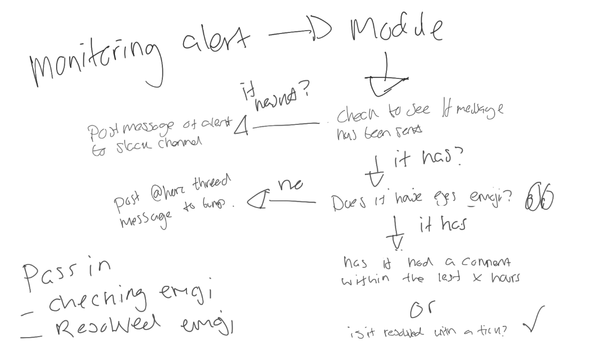
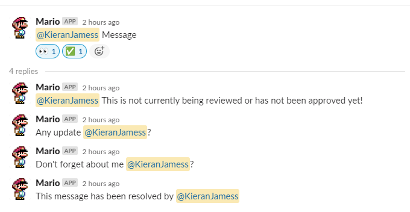

## Overview
### Intro
Built from [Mario](https://github.com/KieranJamess/Slackbot-AzureDevops-MonitorPRs/tree/main), this is a central application to push and monitor slack messages for basic jobs.
### The Idea
Instead of having multiple applications running and sending messages to slack using the same duplicated code, this is a central system that will manage the messages for you. 

### Features
- Monitor slack messages for being reviewed and/or being approved
- Set own approval and reviewing emojis for process
- Override default monitor interval per message

## Setup
### config.json
```
{
    "port": 80,
    "slack_access_token":"",
    "approval_emoji": "white_check_mark",
    "reviewing_emoji": "eyes",
    "reviewing_interval": 1
}
```
- Port - The port to expose the bot to (not running inside the dockerfile)
- slack_access_token - The token for your slack bot
- approval_emoji - The emoji reacted on the message to be marked as resolved
- reviewing_emoji - The emoji reacted on the message to be marked as being reviewed
- reviewing_interval - The interval in minutes to check for any reaction updates
### Slackbot permissions
The slackbot for this operation will need `emoji:read` and `reactions:read`
## Using
### Payload template
```
{
    "message":  "Message",
    "channel":  "C05Q0F85EGZ",
    "mentions":  [
                     "UD1QZGTSS"
                 ],
    "reminderIntervals":  2
}
```
- message - The text for the message to use in the intial slack message
- channel - The Slack channel ID to send the message to
- mentions - The user(s) or group(s) ID to mention
- reminderIntervals - Override the default interval for specific messages 
### Sending Payload
If you take a look into the tests folder, you will see a basic powershell script that was used for testing. This sends the application a basic JSON payload to trigger a message and monitoring process. 
## Flow
### Example

1. The reviewing or approving emoji isn't present within time interval so the bot sends a messsage for an update
2. A user reacts to the message with the reviewing emoji
3. That user hasn't resolved the incident with the given timeframe, send an follow up message
4. Same again as step 3
5. The user has resolved the incident
